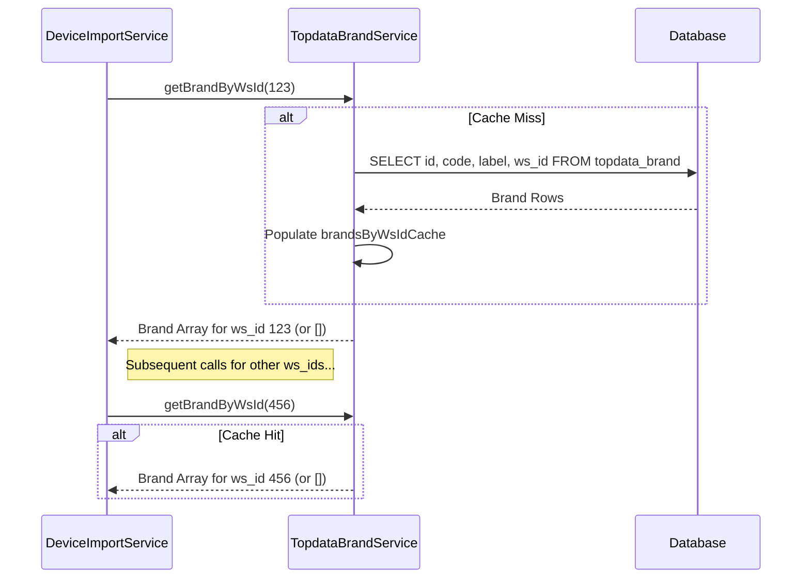

# Plan: Refactor Brand Lookup Logic

**Goal:** Move the logic for looking up brands by their webservice ID (`ws_id`) from `DeviceImportService` to `TopdataBrandService` to improve code organization and reusability.

**Steps:**

1.  **Enhance `TopdataBrandService` (`src/Service/DbHelper/TopdataBrandService.php`):**
    *   Add a private property for caching brands indexed by `ws_id`:
        ```php
        private ?array $brandsByWsIdCache = null;
        ```
    *   Create a private helper method `_loadBrandsByWsId()`:
        *   Check if `$brandsByWsIdCache` is already populated.
        *   If not, query the `topdata_brand` table for `id`, `code`, `label`, and `ws_id`.
        *   Convert the binary `id` to hex for each brand.
        *   Populate `$brandsByWsIdCache` with the results, keyed by `ws_id`.
    *   Create a new public method `getBrandByWsId(int $brandWsId): array`:
        *   Call `_loadBrandsByWsId()` to ensure the cache is loaded.
        *   Return the brand array from `$brandsByWsIdCache` based on the provided `$brandWsId`.
        *   Return an empty array `[]` if the `$brandWsId` is not found in the cache.

2.  **Refactor `DeviceImportService` (`src/Service/Import/DeviceImportService.php`):**
    *   **Dependency Injection:**
        *   Add `TopdataBrandService` to the constructor parameters.
        *   Store the injected service in a private readonly property:
            ```php
            private readonly TopdataBrandService $topdataBrandService
            ```
    *   **Remove Redundancy:**
        *   Delete the `private ?array $brandWsArray = null;` property.
        *   Delete the `private function _getBrandByWsIdArray(int $brandWsId): array` method.
    *   **Update Method Calls:**
        *   In the methods `setDeviceTypes`, `setSeries`, `setDevices`, and `setDeviceMedia`, replace all calls like:
            ```php
            $brand = $this->_getBrandByWsIdArray($someWsId);
            ```
            with:
            ```php
            $brand = $this->topdataBrandService->getBrandByWsId($someWsId);
            ```

**Visualization:**



**Benefits:**

*   Improved code cohesion (`DeviceImportService` focuses on devices).
*   Centralized brand data logic (`TopdataBrandService`).
*   Increased reusability of brand lookup functionality.
*   Enhanced maintainability.