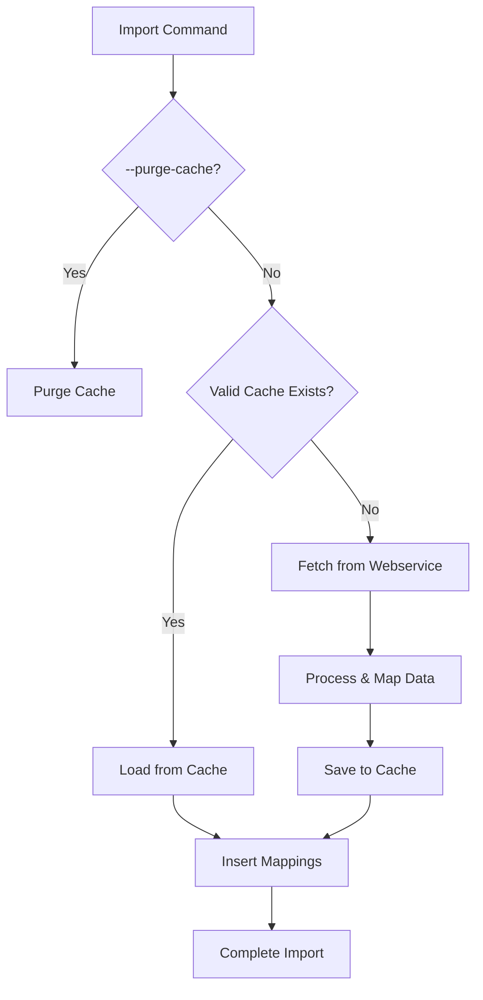

# Integrated Caching Strategy for EAN/OEM Mappings

## Objective
Combine cache infrastructure improvements with code refactoring to create a maintainable, high-performance mapping solution that reduces webservice calls while maintaining data freshness.

## Architecture Overview


## Implementation Phases

### 1. Code Refactoring (MappingStrategy_EanOem)
- **Separation of Concerns**
    - Create `processWebserviceMappings()` method handling API communication
    - Extract `handleCacheOperations()` for cache lifecycle management
- **Batch Processing**
    - Modify `_processEANs()`, `_processOEMs()`, `_processPCDs()` to return raw mappings
    - Add `$mappingType` parameter to track EAN/OEM/PCD sources

### 2. Cache Integration
- **Service Wiring**
    - Inject `MappingCacheService` into `MappingStrategy_EanOem`
    - Implement cache validation checks using existing `hasCachedMappings()`
- **Data Flow**
  ```php
  // Example cache-aware processing
  if ($config->experimentalV2) {
      $mappings = $this->collectMappingsFromWebservice();
      $this->mappingCacheService->saveMappingsToCache($mappings);
  }
  ```


## Validation Plan

| Test Case                  | Method                          | Success Criteria                     |
|----------------------------|---------------------------------|--------------------------------------|
| Cache Miss Scenario        | Run import without valid cache  | All mappings saved to cache table    |
| Cache Hit Scenario         | Run import with valid cache     | Zero webservice calls logged         |
| Cache Expiration           | Wait 24+ hours between imports  | Cache automatically refreshes        |
| Partial Cache Invalidation | Purge specific mapping types    | Only targeted mappings are cleared   |

3. **Monitoring**
    - Add Prometheus metrics:
        - `mappings_cache_hits_total`
        - `mappings_cache_size_bytes`
        - `webservice_calls_saved_total`
