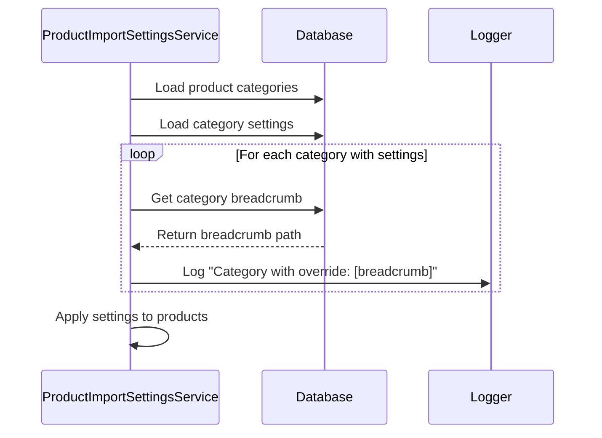

# Plan: Enhance ProductImportSettingsService to Log Category Breadcrumbs

## Objective
Modify the `ProductImportSettingsService` class to log the full breadcrumb path of categories that have configuration overrides set during product import.

## Current Behavior
The `loadProductImportSettings()` method currently:
1. Loads category paths for products
2. Fetches import settings for these categories
3. Applies the most specific category override to each product
4. Does not log which categories have overrides or their hierarchy

## Proposed Changes

### 1. Add Breadcrumb Fetching Method
```php:src/Service/Config/ProductImportSettingsService.php
private function getCategoryBreadcrumb(string $categoryId): string
{
    $path = $this->connection->fetchOne('
        SELECT GROUP_CONCAT(category_translation.name ORDER BY category.path SEPARATOR " > ")
        FROM category
        JOIN category_translation ON category.id = category_translation.category_id
        JOIN (
            SELECT id, path FROM category WHERE id = UNHEX(:categoryId)
        ) AS target ON category.path LIKE CONCAT(target.path, '%')
        WHERE category_translation.language_id = UNHEX(:languageId)
    ', [
        'categoryId' => str_replace('-', '', $categoryId),
        'languageId' => $this->getDefaultLanguageId()
    ]);
    
    return $path ?: $categoryId;
}
```

### 2. Add Default Language Helper
```php:src/Service/Config/ProductImportSettingsService.php
private function getDefaultLanguageId(): string
{
    return $this->connection->fetchOne(
        'SELECT LOWER(HEX(id)) FROM language WHERE is_default = 1 LIMIT 1'
    ) ?: '';
}
```

### 3. Add Logging in loadProductImportSettings()
```php:src/Service/Config/ProductImportSettingsService.php
// After loading category settings
foreach ($allCategories as $categoryId => $settings) {
    if ($settings !== false) {
        $breadcrumb = $this->getCategoryBreadcrumb($categoryId);
        CliLogger::info("Category with override: $breadcrumb");
    }
}
```

### 4. Import CliLogger
```php:src/Service/Config/ProductImportSettingsService.php
use Topdata\TopdataConnectorSW6\Util\CliLogger;
```

## Process Flow


## Implementation Notes
1. The solution fetches breadcrumbs only for categories with overrides
2. Uses a single optimized SQL query to get the full breadcrumb path
3. Respects the system's default language for translations
4. Falls back to category ID if breadcrumb can't be determined
5. Logs at INFO level to avoid cluttering output during normal operation

## Testing Plan
1. Create test categories with overrides at different hierarchy levels
2. Verify breadcrumbs are correctly logged during import
3. Test with categories that have no name translations
4. Verify performance with large category trees

## Estimated Effort
~2 hours development time including testing